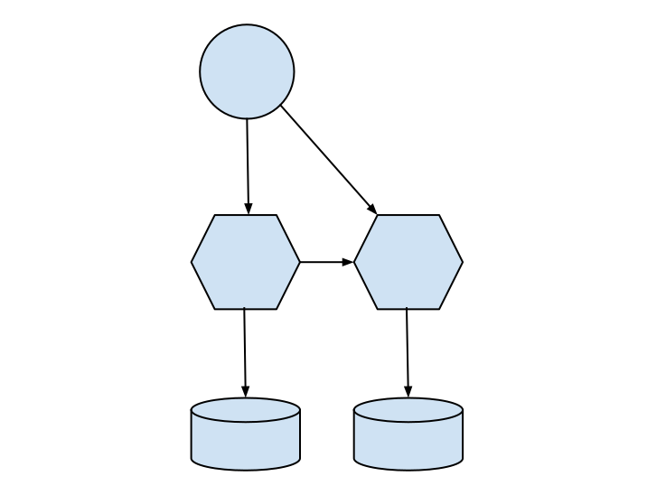

# Architecture

My thoughs on building service oriented architecture

### Databases

Avoid sharing databases between services

Try to have one database for each service

### Coupling

Avoid sharing internal state with external services

Try to expose internal state using external interfaces

### Dependencies

Avoid creating unecessary dependencies inside base services

Try to manage data relationships in the applications. Duplicating the logic once
or twice is not DRY but it is more flexible

If many applications depens on the same logic create another service unifying the
base services. If need be an application can both be dependent of the base services and
the service aggregate

### TODO
 * What is what?
  * Hexagon: Microservices
  * Vertical silos: Databases
  * Circles: Applications
 * Sync vs Async
